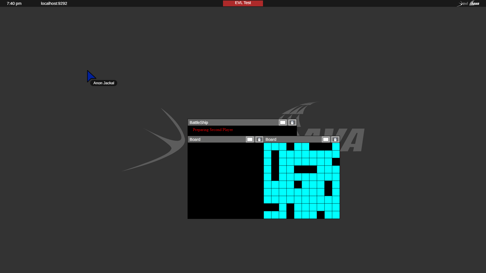
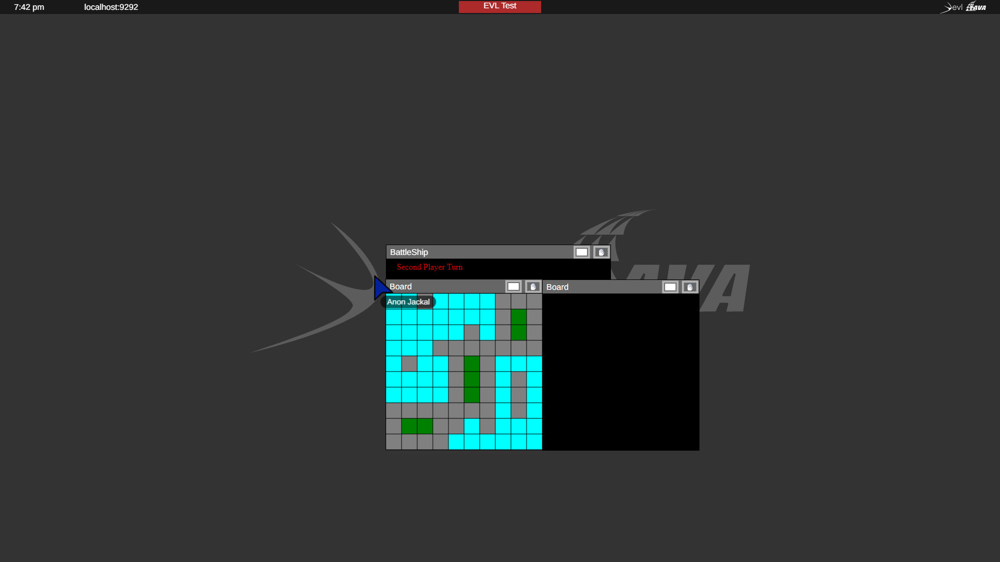

= Příklady aplikací pro Sage2 

== Rodičovské a odvozené aplikace

=== Tvorba aplikace

Podíváme se na Rodičovské a odvozené aplikace a jejich interakce na příkladu hry "Námořní bitva"

Pro interakci použijeme následující funkce:

==== Pošleme požadavek na server za účelem spuštění odvozené aplikace
[source,js]
----
launchAppWithValues: function(appName, paramObj, x, y, funcToPassParams)
----

  * appName - název programu, který se má spustit ze seznamu aplikací
  
  * paramObj - volitelný parametr, který bude předán jako argument funkci 'funcToPassParams'. Musí to být typ Object!
  
  * x, y - souřadnice, kde bude aplikace spuštěna
  
  * funcToPassParams - název funkce, která bude volána po inicializaci aplikace ve formátu řetězce

==== Funkce pro inicializaci proměnné na serveru
[source,js]
----
serverDataSetValue: function(nameOfValue, value, description, shouldRemoveValueFromServerWhenAppCloses = false)
----

  * nameOfValue - název proměnné. Pokud proměnná již existuje, přiřadí jí novou hodnotu
  
  * value - hodnota, která má být přiřazena proměnné. 
  
  * description - popis proměnné
  
  * shouldRemoveValueFromServerWhenAppCloses - měla by být proměnná odstraněna ze serveru po ukončení aplikace

==== Pro kontrolu změny hodnoty proměnne na serveru
[source,js]
----
serverDataSubscribeToValue: function(nameOfValue, callback, unsubscribe = false)
----

  * nameOfValue - název proměnné
  
  * callback - funkce, která bude volána, když se proměnná změní a vezme její novou hodnotu jako argument
  
  * unsubscribe - zapnout nebo vypnout sledování
  
==== Pokud potřebujeme přímo zavolat funkci z rodičovské aplikace
[source,js]
----
sendDataToParentApp(nameOfFunction, data)
----

  * nameOfFunction - nazev funkce ve formátu řetězce
  
  * data - hodnota předaná funkci

/// Rodičovská aplikace
.instructions.json
[source,js]
----
{
  "main_script": "Game.js",
  "width": 100,
  "height": 20,
  "animation": true,
  "title": "BattleShip",
  "author": "Oleksandr Khokhych"
}
----

.Game.js
[source,js]
----
var Game = SAGE2_App.extend({

    init: function (data) {

        this.SAGE2Init("canvas", data);
        this.ctx = this.element.getContext("2d");
        this.resizeEvents = "continuous";

        var num1 = new Object();
        var num2 = new Object();
        num1.val = 1; 
        num2.val = 2;

        this.launchAppWithValues("Board", num1, this.sage2_x, this.sage2_y + 40, "setNum");
        this.launchAppWithValues("Board", num2, this.sage2_x + 300, this.sage2_y + 40, "setNum");

        this.ctx.lineWidth = 2;
        this.ctx.strokeStyle = "grey";
        this.ctx.font = "16px serif";

        this.statement = 0;
    },

    resize: function (date) {
        this.refresh(date);
    },

    draw: function (date) {

        this.ctx.fillStyle = "black";
        this.ctx.fillRect(0, 0, this.element.width, this.element.height);

        this.update(date);
    },

    nextstate: function (date) {
        this.statement = (this.statement === 4 ? 3 : this.statement + 1);
        this.refresh(date);
    },

    update: function (date) {

        this.ctx.fillStyle = "red";

        switch (this.statement) {

            case 0:
                this.serverDataSetValue("FirstPlayerState", "waiting", "First player statement variable", true);
                this.serverDataSetValue("SecondPlayerState", "waiting", "Second player statement variable", true);
                this.ctx.fillText("Press R to start the game", 20, 20);
                break;

            case 1:
                this.serverDataSetValue("FirstPlayerState", "waiting", "First player statement variable", true);
                this.serverDataSetValue("SecondPlayerState", "preparation", "Second player statement variable", true);
                this.ctx.fillText("Preparing Second Player", 20, 20);
                break;

            case 2: 
                this.serverDataSetValue("FirstPlayerState", "preparation", "First player statement variable", true);
                this.serverDataSetValue("SecondPlayerState", "waiting", "Second player statement variable", true);
                this.ctx.fillText("Preparing First Player", 20, 20);
                break;

            case 3:
                this.serverDataSetValue("FirstPlayerState", "waiting", "First player statement variable", true);
                this.serverDataSetValue("SecondPlayerState", "turn", "Second player statement variable", true);
                this.ctx.fillText("First Player Turn", 20, 20);
                break;

            case 4:
                this.serverDataSetValue("FirstPlayerState", "turn", "First player statement variable", true);
                this.serverDataSetValue("SecondPlayerState", "waiting", "Second player statement variable", true);
                this.ctx.fillText("Second Player Turn", 20, 20);
                break;

        }
    }
});
----

/// Odvozená aplikace
.instructions.json
[source,js]
----
{
  "main_script": "Board.js",
  "width": 300,
  "height": 300,
  "animation": true,
  "title": "Board",
  "author": "Oleksandr Khokhych"
}
----

.Board.js
[source,js]
----
var Board = SAGE2_App.extend({

    init: function (data) {

        this.SAGE2Init("canvas", data);
        this.ctx = this.element.getContext("2d");

        this.resizeEvents = "continuous";

        this.size = 30;

        this.backcolor = "cyan";
        this.color = "black";

        this.presetboard = new Array(10);
        this.gameboard = new Array(10);

        for (var i = 0; i < 10; i++) {
            this.presetboard[i] = new Array(10);
            this.gameboard[i] = new Array(10);
            for (var j = 0; j < 10; j++) {
                this.presetboard[i][j] = false;
                this.gameboard[i][j] = 0;
            }
        }

        //                 X  Y      X  Y      X  Y
        this.nighbors = [[-1, -1],  [0, -1],  [1, -1],
                         [-1, 0], /*[0, 0],*/ [1, 0],
                         [-1, 1],   [0, 1],   [1, 1]];

        this.statement = "waiting";
    },

    clean: function () {
        this.ctx.fillStyle = this.backcolor;
        this.ctx.fillRect(0, 0, this.element.width, this.element.height);
    },

    drawLine: function (x0, y0, x1, y1) {
        // Otevírá blok. Všechno, co bude nakresleno uvnítř bloku stane současti jedné figury
        this.ctx.beginPath();
        // Přenesé pero na pozici (x0, y0)
        this.ctx.moveTo(x0, y0);
        // Nakreslí čáru od současné pozici pera do bodu (x1, y1)
        this.ctx.lineTo(x1, y1);
        // Obárví vysledek a uzavřé blok
        this.ctx.stroke();
    },

    drawgrid: function () {

        this.ctx.fillStyle = "black";

        for (var i = 0; i < 11; i++) {
            this.drawLine(i * 30, 0, i * 30, 300);
            this.drawLine(0, i * 30, 300, i * 30);
        }
    },

    drawpreset: function () {

        this.ctx.fillStyle = this.color;

        for (var y = 0; y < 10; y++) {
            for (var x = 0; x < 10; x++) {
                if (this.presetboard[y][x]) {
                    this.ctx.fillRect(x * this.size, y * this.size, this.size, this.size);
                }
            }
        }

        this.drawgrid();
    },

    drawmap: function () {

        for (var y = 0; y < 10; y++) {
            for (var x = 0; x < 10; x++) {
                if (this.gameboard[y][x] === 1) {
                    this.ctx.fillStyle = "grey";
                    this.ctx.fillRect(x * this.size, y * this.size, this.size, this.size);
                }
                else if (this.gameboard[y][x] === 2) {
                    this.ctx.fillStyle = "green";
                    this.ctx.fillRect(x * this.size, y * this.size, this.size, this.size);
                }
            }
        }

        this.drawgrid();
    },

    draw: function (date) {

        this.clean();

        switch (this.statement) {

            case "waiting":
                this.ctx.fillStyle = "black";
                this.ctx.fillRect(0, 0, this.element.width, this.element.height);
                break;

            case "preparation":
                this.drawpreset();
                break;

            case "turn":
                this.drawmap();
                break;
        }
    },

    resize: function (date) {
        this.refresh(date);
    },

    setState: function (val) {
        this.statement = val;
    },

    setNum: function (num) {
        if (num.val === 1) this.serverDataSubscribeToValue("FirstPlayerState", this.setState);
        if (num.val === 2) this.serverDataSubscribeToValue("SecondPlayerState", this.setState);
    },

    contain: function (tmp, [y, x]) {
        for (let [b, a] of tmp) {
            if (x == a && y == b) return false;
        }
        return true;
    },

    bfsfill: function (ty, tx) {
        //...
    },

    event: function (eventType, position, user_id, data, date) {

        if (eventType === "pointerPress" && (data.button === "left")) {

            var x = parseInt(position.x / this.size);
            var y = parseInt(position.y / this.size);

            if (this.statement === "preparation") this.presetboard[y][x] = !this.presetboard[y][x];
            if (this.statement === "turn") {
                if (this.presetboard[y][x]) {
                    this.gameboard[y][x] = 2;
                    this.bfsfill(y, x);
                }
                else {
                    this.gameboard[y][x] = 1;
                    this.sendDataToParentApp("nextstate", date);
                }
            }
        }

        else if (eventType === "keyboard") {

            if (data.character === "r") {
                this.sendDataToParentApp("nextstate", date);
            }
        }
    }
});
----

