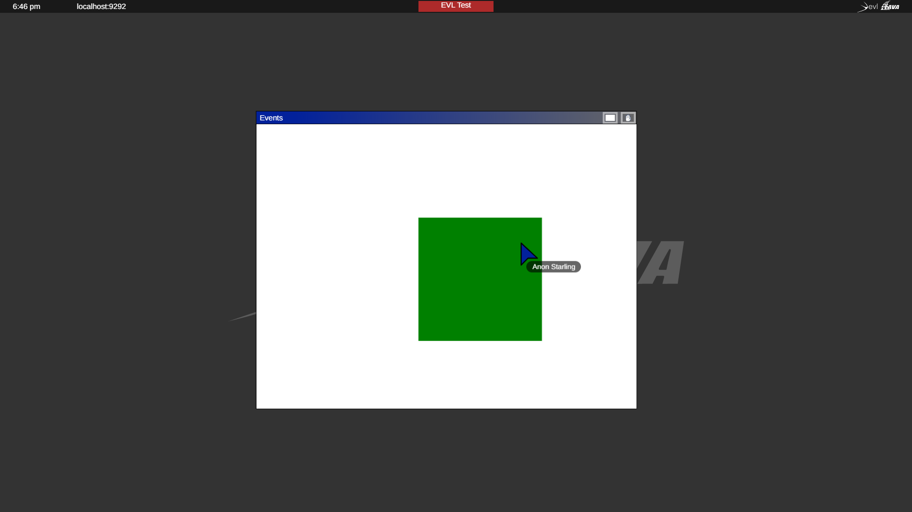

= Příklady aplikací pro Sage2 

== Akce

=== Tvorba aplikace

Tento příklad byl vytvořen, aby demonstroval, jak pracovat se systémem událostí.

Mezi úkoly demo příkladu patří manipulace s tlačítky a kurzorem myši (tažení objektu), čtení stisknutí klávesnice

K tomu použijeme funkci 

[source,js]
----
event: function (eventType, position, user_id, data, date);
----

Bude vyvolána při jakékoli akci uživatele.

    * eventType - obsahuje typ události
    
    * position - obsahuje souřadnice (x, y) kurzoru 
    
    * user_id - obsahuje unikantni id uživatele
    
    * data - obsahuje zakladni informace ob aplikaci
    
    * date - obsahuje čas
    
.instructions.json
[source,js]
----
{
  "main_script": "Events.js",
  "width": 800,
  "height": 600,
  "animation": true,
  "title": "Events",
  "author": "Oleksandr Khokhych"
}
----

.Events.js
[source,js]
----
var Events = SAGE2_App.extend({

    init: function (data) {

        this.SAGE2Init("canvas", data);

        this.ctx = this.element.getContext("2d");

        this.resizeEvents = "continuous";
        
        // počáteční souřadnice objektu
        this.Xpos = this.element.width / 2;
        this.Ypos = this.element.height / 2;
        
        //inicializace vlastností objektu: rychlost, velikost, barva, stav
        this.speed = 10;
        this.size = 40;
        this.color = "red";
        this.grab = false;
        
        // souřadnice objektu vzhledem ke kurzoru
        this.deltaX = 0;
        this.deltaY = 0;
    },

    draw: function (date) {
        
        // vyčistim obrazovku
        this.ctx.fillStyle = "white";
        this.ctx.fillRect(0, 0, this.element.width, this.element.height);
        
        // nakreslíme čtverec
        this.ctx.fillStyle = this.color;
        this.ctx.fillRect(this.Xpos, this.Ypos, this.size, this.size);
    },
   
    resize: function (date) {
        this.refresh(date);
    },

    event: function (eventType, position, user_id, data, date) {
        // pokud bylo stisknuto levé tlačítko myši
        if (eventType === "pointerPress" && (data.button === "left")) {
            // pokud je pozice kurzoru uvnitř čtverce
            if (position.x >= this.Xpos && position.x <= this.Xpos + this.size &&
                position.y >= this.Ypos && position.y <= this.Ypos + this.size) {
                
                // změnime stav a barvu objektu
                this.grab = true;
                this.color = "green";
                
                // vypočítáme pozice čtverce vzhledem k kurzoru myši
                this.deltaX = position.x - this.Xpos;
                this.deltaY = position.y - this.Ypos;

                this.refresh(date);
            }
        }
        // pokud se kurzor pohybuje
        else if (eventType === "pointerMove") {
            // pokud je kurzor sevřen na objektu
            if (this.grab) {
                // vypočítáme novou pozice čtverce
                this.Xpos = position.x - this.deltaX;
                this.Ypos = position.y - this.deltaY;

                this.refresh(date);
            }
        }
        // pokud uživatel uvolnil levé tlačítko myši
        else if (eventType === "pointerRelease" && (data.button === "left")) {
            // pokud kurzor byl sevřen na objektu
            if (this.grab) {
                // změnime stav a barvu objektu
                this.grab = false;
                this.color = "red";
                
                this.refresh(date);
            }
        }
        // pokud používáme kolečko myši
        else if (eventType === "pointerScroll") {
            // pokud kurzor byl sevřen na objektu
            if (this.grab) {
            
                let kx = this.deltaX / this.size;
                let ky = this.deltaY / this.size;
                
                // měníme velikost čtverce v závislosti na deltě otáčení
                let newSize = this.size - data.wheelDelta * 0.2;
                this.size = newSize > 10 ? newSize : 10;

                this.deltaX = kx * this.size;
                this.deltaY = ky * this.size;

                this.Xpos = position.x - this.deltaX;
                this.Ypos = position.y - this.deltaY;
                
                this.refresh(date);
            }
        }
        // téma widgetů bude probrána v jiném příkladu
        else if (eventType === "widgetEvent") {
            this.refresh(date);
        }
        // pokud bylo stisknuto tlačítko na klávesnici
        else if (eventType === "keyboard") {
            // pokud je stisknuto tlačítko 'r'
            if (data.character === "r") {
                this.size = 40;
                this.refresh(date);
            }
        }
        // pokud bylo stisknuto jedno z funkčních tlačítek 
        else if (eventType === "specialKey"){
            // šipka vlevo
            if (data.code === 37 && data.state === "down") {
                this.Xpos -= this.speed; // posuneme objekt vlevo
                this.refresh(date);
            }
            // šipka nahoru
            else if (data.code === 38 && data.state === "down") {
                this.Ypos -= this.speed; // posuneme objekt nahoru
                this.refresh(date);
            }
            // šipka vpravo
            else if (data.code === 39 && data.state === "down") {
                this.Xpos += this.speed; // posuneme objekt vpravo
                this.refresh(date);
            }
            // šipka dolu
            else if (data.code === 40 && data.state === "down") {
                this.Ypos += this.speed; // posuneme objekt dolu
                this.refresh(date);
            }
        }
    }
});
----

