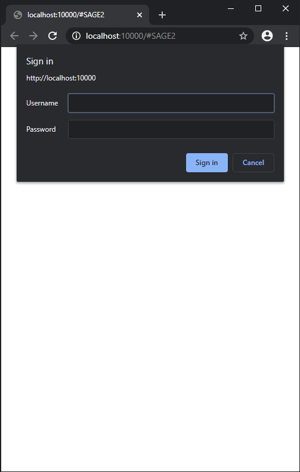
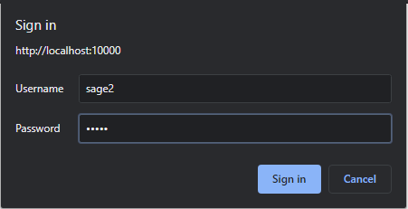

= Příklady aplikací pro Sage2 

== Instalace a konfigurace SAGE2

Nejprve se ujistěte, že máte nainstalovaný Google Chrome

Celý proces rozdělíme do 2 jednoduchých kroků.

=== Stažení a instalace

Stáhneme si aplikaci z oficiální stránky SAGE2. http://sage2.sagecommons.org/downloads/[Stáhnout sage2]
  

Spusťte aplikaci

Pokud se zobrazí zpráva o možném riziku pro systém, ignorujte ji a souhlaste s instalací

Vyberte adresář pro instalaci SAGE

Počkejte, až se soubory rozbalí

Po skončení procesu rozbalení můžeme instalační soubor odstranit

=== Spuštění a konfigurace

Otevřete rozbalenou složku a spusťte Launcher.bat

Pokud uvidíte okno brány firewall, povolte přístup pro soukromé a veřejné sítě

Po spuštění se automaticky otevře okno Google Chrome

Potřebujete uvest uživatelské jméno a heslo. Výchozí hodnoty:

`login`: sage2

`password`: sage2

